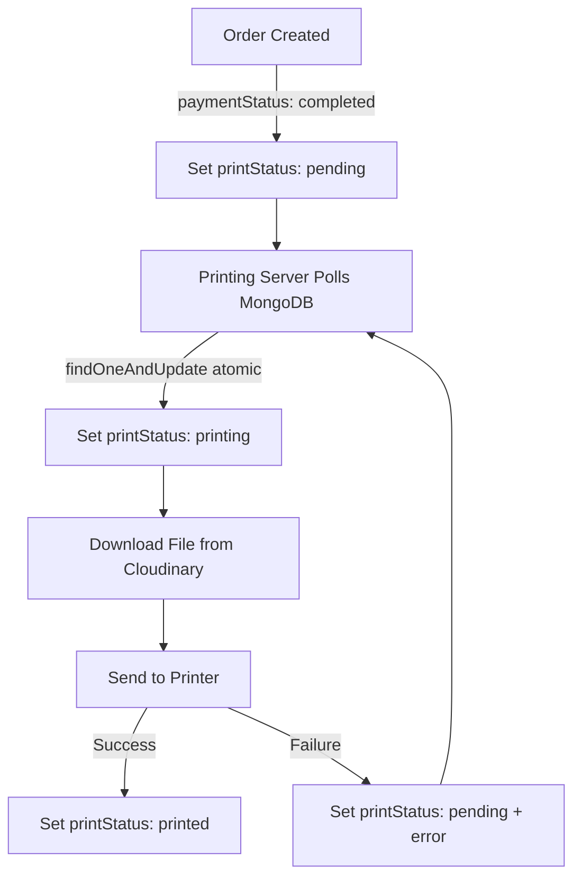

# Printing System Architecture

## Overview

The printing system has been redesigned to use MongoDB as the single source of truth, eliminating API communication between the website and printing server. Both systems read from and write to the same MongoDB database.

## Architecture Diagram

```
┌─────────────────┐         ┌─────────────────┐
│   Website       │         │ Printing Server │
│   (Next.js)     │         │   (Node.js)     │
└────────┬────────┘         └────────┬────────┘
         │                            │
         │                            │
         └──────────┬─────────────────┘
                    │
                    ▼
         ┌──────────────────────┐
         │   MongoDB Database   │
         │  (Single Source of   │
         │       Truth)         │
         └──────────────────────┘
                    │
         ┌──────────┼──────────┐
         │          │          │
         ▼          ▼          ▼
    ┌────────┐ ┌────────┐ ┌────────┐
    │ orders │ │printers│ │print_  │
    │        │ │        │ │ logs   │
    └────────┘ └────────┘ └────────┘
```

## Data Flow

### Order Processing Flow



### State Machine

```
pending → printing → printed
   ↑         │
   └─────────┘ (on failure)
```

**State Rules:**
- Only `pending` orders can be claimed
- State transitions are atomic (using `findOneAndUpdate`)
- Duplicate printing is impossible:
  - Atomic claim prevents race conditions
  - `printJobId` idempotency check prevents re-printing
  - Worker ownership ensures only one worker processes each job

## Database Schema

### Orders Collection

```typescript
{
  _id: ObjectId,
  orderId: string,
  paymentStatus: 'pending' | 'completed' | 'failed',
  printStatus: 'pending' | 'printing' | 'printed',
  printError?: string,
  printerId?: string,
  printerName?: string,
  printStartedAt?: Date,
  printCompletedAt?: Date,
  // Production-critical fields
  printJobId?: string,        // UUID for idempotency (unique, indexed)
  printAttempt?: number,      // Number of print attempts (default: 0)
  printingBy?: string,       // Worker ID that owns this job (indexed)
  fileURL: string,
  printingOptions: {...},
  // ... other fields
}
```

**Indexes:**
- `{ printStatus: 1, paymentStatus: 1, createdAt: 1 }`
- `{ printStatus: 1, createdAt: -1 }`
- `{ printerId: 1, printStatus: 1 }`
- `{ printJobId: 1 }` (unique, sparse)
- `{ printingBy: 1, printStatus: 1 }`

### Printers Collection

```typescript
{
  _id: ObjectId,
  name: string,
  printer_id: string,              // NEW
  printer_name: string,            // NEW
  status: 'online' | 'offline' | 'busy' | 'error',
  last_seen_at: Date,              // NEW
  last_successful_print_at?: Date, // NEW
  queue_length: number,            // NEW
  error_message?: string,          // NEW
  driver_name?: string,             // NEW
  system_name: 'Windows' | 'Linux', // NEW
  connectionType: 'usb' | 'network' | 'wireless',
  isActive: boolean,
  autoPrintEnabled: boolean,
  // ... other fields
}
```

**Indexes:**
- `{ status: 1, isActive: 1 }`
- `{ printer_id: 1 }` (unique)
- `{ last_seen_at: -1 }`

### Print Logs Collection

```typescript
{
  _id: ObjectId,
  action: string,           // 'reprint', 'cancel', 'reset_state', 'force_printed', 'server_shutdown'
  orderId: string,
  printJobId?: string,      // Print job ID for idempotency tracking
  adminId?: string,
  adminEmail?: string,
  previousStatus?: string,
  newStatus?: string,
  reason?: string,
  timestamp: Date,
  metadata?: object
}
```

**Indexes:**
- `{ orderId: 1, timestamp: -1 }`
- `{ timestamp: -1 }`
- `{ action: 1, timestamp: -1 }`

### Metrics Collection

```typescript
{
  _id: ObjectId,
  timestamp: Date,
  prints_per_hour: number,
  failures_per_hour: number,
  average_print_start_delay: number,  // seconds
  printer_offline_duration: number,  // seconds
  workerId: string,
  createdAt: Date,
  updatedAt: Date
}
```

**Indexes:**
- `{ timestamp: -1 }`
- `{ workerId: 1, timestamp: -1 }`

## Printing Server Behavior

### Order Processing

1. **Poll MongoDB** every 5 seconds (configurable) for orders with:
   - `printStatus: 'pending'`
   - `paymentStatus: 'completed'`
   - Has file URL(s)

2. **Validate Capabilities:**
   - Check order requirements against printer capabilities
   - Skip orders that don't match (page size, color, duplex, copies)

3. **Atomically Claim Order:**
   ```typescript
   const printJobId = randomUUID();
   const workerId = getWorkerId();
   const order = await Order.findOneAndUpdate(
     { 
       _id: orderId, 
       printStatus: 'pending', 
       paymentStatus: 'completed' 
     },
     { 
       $set: { 
         printStatus: 'printing',
         printStartedAt: new Date(),
         printJobId: printJobId,
         printingBy: workerId,
         printAttempt: 1,
         ...
       } 
     },
     { new: true }
   );
   ```

4. **Check Idempotency:**
   - Verify `printJobId` has not been printed before
   - Skip printing if already printed

4. **Process Order:**
   - Download file from Cloudinary
   - Validate file (existence, size, PDF header)
   - Check idempotency: skip if `printJobId` already printed
   - Send to printer
   - On success: Update to `printStatus: 'printed'` (only if owned by this worker)
   - On failure: Reset to `printStatus: 'pending'` with error message (only if owned by this worker)
   - Increment `printAttempt` on failure

### Printer Health Monitoring

1. **Check Health** every 30 seconds (configurable):
   - Query Windows Print Spooler for printer status
   - Update MongoDB `printers` collection with:
     - Status (online/offline/busy/error)
     - Queue length
     - Last seen timestamp
     - Error messages

2. **Only Process Orders** if printer is online

3. **Auto-Recovery**: When printer comes back online, processing resumes automatically

### Stuck Order Detection

- Orders in `printing` state for > 30 minutes are automatically reset to `pending`
- Logged to `print_logs` for admin review

## Admin UI

### Real-time Updates

The admin monitor page (`/admin/printer-monitor`) uses:

1. **MongoDB Change Streams** (if replica set available)
2. **Polling Fallback** (every 2-3 seconds) if replica set not available

### Features

1. **Order Groups:**
   - Pending Orders
   - Printing Orders
   - Printed Orders (last 24 hours)

2. **Printer Health Panel:**
   - Status indicator (color-coded)
   - Queue length
   - Last successful print
   - Error messages

3. **Admin Actions:**
   - Reprint failed order
   - Cancel pending order
   - Reset stuck order
   - Force mark as printed

All actions are logged to `print_logs` collection.

## Atomic Operations

### Preventing Duplicate Printing

The system uses multiple layers of protection:

1. **Atomic Claim with Ownership:**
```typescript
const printJobId = randomUUID();
const workerId = getWorkerId();

const order = await Order.findOneAndUpdate(
  { 
    _id: orderId, 
    printStatus: 'pending',  // Condition: only update if still pending
    paymentStatus: 'completed' 
  },
  { 
    $set: { 
      printStatus: 'printing',
      printStartedAt: new Date(),
      printJobId: printJobId,      // Unique UUID
      printingBy: workerId,        // Worker ownership
      printAttempt: 1,
      printerId: printerId,
      printerName: printerName
    }
  },
  { new: true }
);
```

2. **Idempotency Check:**
```typescript
// Before printing, check if printJobId already printed
const alreadyPrinted = await Order.findOne({
  printJobId: printJobId,
  printStatus: 'printed'
});

if (alreadyPrinted) {
  // Skip printing - already done
  return;
}
```

3. **Ownership Verification:**
```typescript
// Only allow owning worker to complete/reset
const result = await Order.findOneAndUpdate(
  {
    _id: orderId,
    printingBy: workerId,  // Must be owned by this worker
    printStatus: 'printing'
  },
  { $set: { printStatus: 'printed', ... } }
);
```

This ensures:
- Only one printing server can claim an order (atomic claim)
- No duplicate printing (printJobId idempotency)
- Safe concurrent access (worker ownership)
- Graceful handling of server restarts (ownership-based recovery)

## Error Handling

### Printer Offline

- Orders remain in `pending` state
- Printer status updated to `offline` in MongoDB
- Admin UI shows printer as offline
- Processing resumes when printer comes back online
- Offline duration tracked in metrics

### Print Failure

- Order reset to `pending` with error message (only by owning worker)
- Error logged in `printError` field
- `printAttempt` incremented
- `printJobId` cleared to allow new attempt
- Printing server will retry on next poll
- Admin can manually reprint if needed
- Failures tracked in metrics

### Stuck Orders

- Auto-detected after 30 minutes (only orders owned by this worker)
- Automatically reset to `pending`
- Logged to `print_logs` with reason
- Other workers' orders are ignored

### Server Shutdown

- On shutdown (SIGTERM, SIGINT):
  - Find all orders with `printStatus: 'printing'` AND `printingBy: workerId`
  - Reset them to `'pending'` with reason "Server shutdown"
  - Log each reset to `print_logs`
  - Ensures no jobs are left stuck

### Capability Mismatch

- Orders that don't match printer capabilities are skipped
- Marked as failed with capability mismatch error
- Admin can see capability requirements in error message

### File Validation Failure

- Invalid files (missing, too small, invalid PDF) are rejected
- Order marked as failed with validation error
- Admin can see specific validation error

## Security

### Admin Actions

- All admin actions require authentication
- Actions are logged with:
  - Admin email
  - Timestamp
  - Previous and new status
  - Reason

### MongoDB Access

- Website and printing server use same MongoDB connection
- No API keys or authentication between systems
- MongoDB handles access control

## Performance

### Indexes

Critical indexes for performance:
- `orders.printStatus + paymentStatus + createdAt`
- `orders.printStatus + createdAt`
- `orders.printJobId` (unique, sparse)
- `orders.printingBy + printStatus`
- `printers.status + isActive`
- `print_logs.orderId + timestamp`
- `metrics.timestamp` (for metrics queries)
- `metrics.workerId + timestamp`

### Polling Intervals

- Order polling: 5 seconds (configurable)
- Health checks: 30 seconds (configurable)
- Metrics storage: 5 minutes
- Stuck order check: 5 minutes
- Admin UI polling: 2-3 seconds (if Change Streams not available)

## Production-Critical Features

### Print Job Idempotency

- Each print job has unique `printJobId` (UUID)
- System checks if `printJobId` already printed before printing
- Prevents duplicate physical prints
- `printAttempt` counter tracks retry attempts

### Worker Ownership

- Each server has unique `workerId` (UUID + hostname + timestamp)
- Orders claimed with `printingBy: workerId`
- Only owning worker can complete/reset job
- Supports multiple servers safely
- Prevents interference between workers

### Graceful Shutdown

- On shutdown, resets orders owned by this worker
- Logs all shutdown actions
- Ensures no stuck jobs

### Capability Validation

- Validates orders against printer capabilities
- Checks: page size, color, duplex, max copies
- Skips incompatible orders

### File Integrity

- Validates files before printing
- Checks: existence, size, PDF header
- Rejects invalid files safely

### Observability

- Tracks metrics: prints/hour, failures/hour, delays, offline duration
- Stores metrics in MongoDB every 5 minutes
- Viewable in admin UI
- Helps identify performance issues

## Deployment

### Printing Server

1. Install on Windows machine with printer
2. Configure MongoDB connection
3. Set printer name
4. Run as service (PM2 recommended)

### Website

1. Deploy to Vercel/cloud
2. Ensure MongoDB connection string is set
3. Run migration script to add `printStatus` to existing orders

## Migration

Run migration script to:
1. Add `printStatus` field to existing orders
2. Set `printStatus: 'pending'` for completed orders
3. Set `printStatus: 'printed'` for delivered orders
4. Create required indexes
5. Initialize printer records

```bash
npm run migrate-print-status
```

## Monitoring

### Key Metrics

- Orders pending/printing/printed
- Printer online/offline status
- Queue lengths
- Error rates
- Processing times

### Logs

- All state transitions logged
- Admin actions logged
- Errors logged with context
- Stuck order detection logged

## Future Enhancements

- Support for multiple printers
- Priority queue
- Print job scheduling
- Advanced error recovery
- Print preview
- Batch printing

