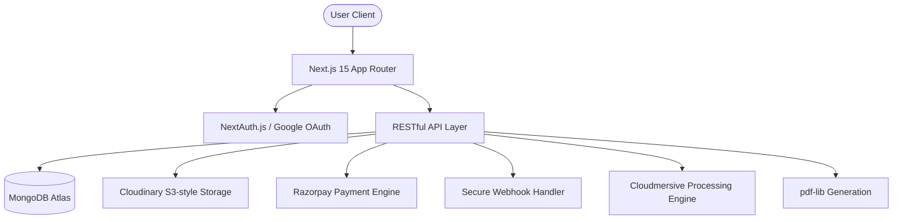

# 🖨️ Fun Printing - Professional SaaS Printing Platform


**Fun Printing** is a modern, full-stack automated printing orchestration platform designed for high-volume campus environments. It streamlines the end-to-end printing lifecycle—from intelligent file queueing and document processing to secure automated payments and real-time order fulfillment.

**Live Demo:** [fun-printing.vercel.app](https://fun-printing.vercel.app)

---

## 🏗️ System Architecture

Fun Printing is engineered for reliability and scalability using a modern event-driven approach.



### Key Engineering Decisions
- **Next.js 15 App Router**: Leveraging Server Components for reduced client-side JavaScript and optimized SEO.
- **React 19 Hooks**: Utilizing the latest React features for efficient state management and concurrent rendering.
- **Atomic Design Components**: Highly modular components for a consistent and reusable UI system.
- **ODM Layer**: Mongoose with strict schema validation for high data integrity.

---

## ✨ Enterprise-Grade Features

### 🔐 Security-First Design
- **Webhook Signature Verification**: Industrial-strength HMAC verification for Razorpay payment webhooks.
- **Secure File Lifecycle**: Automated cleanup of buffers and secure cloud-native link expiration.
- **Container Hardening**: Dockerized environment running with a non-root user (Security Best Practice).
- **Audit Logs**: Comprehensive tracking of order state transitions for accountability.

### 💼 Product Capabilities
- **Intelli-Templates**: Auto-generate academic and professional documents with dynamic data binding.
- **Universal File Support**: Seamless processing of PDF, DOCX, and high-res image formats.
- **Zero-Latency Payments**: Real-time payment verification and instant order queueing.
- **Admin Control Center**: Advanced dashboard for pricing elasticity and inventory tracking.

---

## 🛠️ Tech Stack & DevOps

| Layer | Technology |
|----------|------------|
| **Core** | Next.js 15, React 19, TypeScript 5 |
| **Styling** | Vanilla CSS + Tailwind CSS 4 Architecture |
| **Database** | MongoDB Atlas with Mongoose ODM |
| **DevOps** | Docker (Multi-stage), GitHub Actions (CI/CD) |
| **Integrations** | Razorpay, Cloudinary, Cloudmersive API, Google OAuth |

---

## 🚀 Production Deployment

### Quick Start with Docker
The platform is fully containerized for consistent deployment.

```bash
# Build production-hardened image
docker build -t funprinting:1.0.0 .

# Run with environment variables
docker run -p 3000:3000 --env-file .env funprinting:1.0.0
```

### CI/CD Workflow
Every commit triggers an automated pipeline:
1. **Linting & Type-Checking**: Enforcing code quality with ESLint and TypeScript.
2. **Build Verification**: Ensuring Next.js production builds are successful.
3. **Container Audit**: Verifying Docker build integrity.
4. **Auto-Release**: Pushing tagged versions as GitHub Releases with Docker images.

---

## 📦 Project Structure

```
funPrinting/
├── docs/                   # Technical documentation & architecture guides
├── src/
│   ├── app/                # Next.js App Router (UI & APIs)
│   ├── components/         # Reusable Atomic UI Components
│   ├── lib/                # Modular Core Utilities (DB, Pay, Auth)
│   ├── models/             # Data Models & Schemas
│   └── hooks/              # Custom Business Logic Hooks
├── public/                 # Static Assets & Global Schemas
└── Dockerfile              # Multi-stage OCI-compliant image definition
```

---

## 👨‍💻 Engineering Team
**Lead Developer:** Aditya Pandey  
**Specialization:** Full-Stack Engineering & Cloud Systems  
**GitHub:** [@AdityaPandey-DEV](https://github.com/AdityaPandey-DEV)

---

## 📄 License & Compliance
This software is licensed under the MIT License. Developed for professional evaluation and scalable service orchestration.

---

**Made with ❤️ by Aditya Pandey for Professional Excellence**
