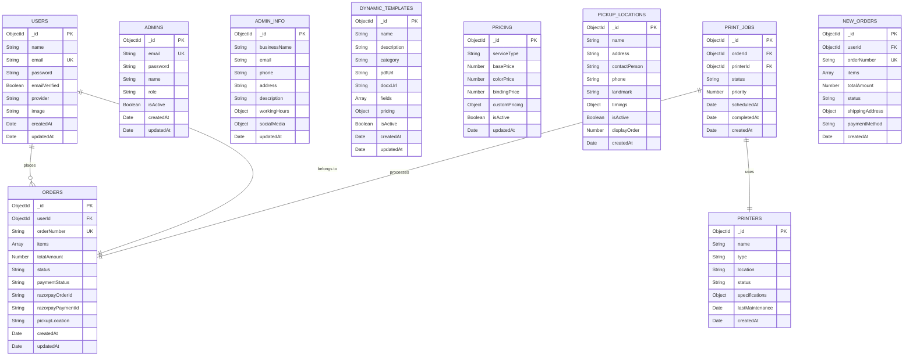

# 📊 Entity-Relationship (ER) Diagram - Fun Printing Database

## 🎯 Complete Database Architecture

---

## 📈 Visual ER Diagram (Mermaid)



---

## 📋 Detailed ER Diagram (Text Format)

### Collection Relationships Overview

```
┌─────────────────────────────────────────────────────────────────┐
│                    DATABASE RELATIONSHIPS                        │
└─────────────────────────────────────────────────────────────────┘

    ┌──────────┐
    │  USERS   │
    └────┬─────┘
         │ 1
         │
         │ places
         │
         │ N
    ┌────▼─────────┐           ┌──────────────┐
    │   ORDERS     │───────────│  PRINT_JOBS  │
    └──────────────┘  1     N  └──────┬───────┘
                                       │ N
                                       │ uses
                                       │ 1
                                  ┌────▼────────┐
                                  │  PRINTERS   │
                                  └─────────────┘

    ┌──────────────────┐
    │ DYNAMIC_TEMPLATES│  (Independent)
    └──────────────────┘

    ┌──────────────┐
    │   PRICING    │  (Configuration)
    └──────────────┘

    ┌────────────────────┐
    │ PICKUP_LOCATIONS   │  (Configuration)
    └────────────────────┘

    ┌──────────────┐
    │   ADMINS     │  (Independent)
    └──────────────┘

    ┌──────────────┐
    │ ADMIN_INFO   │  (Singleton Configuration)
    └──────────────┘
```

---

## 🗂️ Detailed Collection Schemas

### 1️⃣ USERS Collection

**Purpose:** Store user authentication and profile information

```
┌───────────────────────────────────────────────────────────┐
│                      USERS                                 │
├───────────────────────────────────────────────────────────┤
│ PK  _id              : ObjectId                           │
│ UK  email            : String (unique, indexed)           │
│     name             : String (required)                  │
│     password         : String (hashed, optional)          │
│     emailVerified    : Boolean (default: false)           │
│     provider         : Enum['google', 'credentials']      │
│     image            : String (URL, optional)             │
│     createdAt        : Date (auto)                        │
│     updatedAt        : Date (auto)                        │
└───────────────────────────────────────────────────────────┘

Indexes:
  - email (unique, ascending)
  - createdAt (descending)
  
Relationships:
  - One User → Many Orders (1:N)
```

**Field Explanations:**
- `_id`: MongoDB automatically generated unique identifier
- `email`: Unique email address for login (indexed for fast search)
- `password`: Bcrypt hashed password (only for credentials provider)
- `emailVerified`: Whether email has been verified
- `provider`: Login method (Google OAuth or email/password)
- `image`: Profile picture URL (from Google or uploaded)

---

### 2️⃣ ORDERS Collection

**Purpose:** Store customer orders with items and payment details

```
┌───────────────────────────────────────────────────────────┐
│                      ORDERS                                │
├───────────────────────────────────────────────────────────┤
│ PK  _id                : ObjectId                         │
│ FK  userId             : ObjectId → USERS._id             │
│ UK  orderNumber        : String (unique, indexed)         │
│     items              : Array of Objects                 │
│       └─ fileName      : String                           │
│       └─ fileUrl       : String (Cloudinary)              │
│       └─ pages         : Number                           │
│       └─ copies        : Number                           │
│       └─ color         : Boolean                          │
│       └─ sides         : Enum['single', 'double']         │
│     totalAmount        : Number (min: 0)                  │
│     status             : Enum (indexed)                   │
│                          ['PENDING', 'CONFIRMED',         │
│                           'PROCESSING', 'READY',          │
│                           'DELIVERED', 'CANCELLED']       │
│     paymentStatus      : Enum (indexed)                   │
│                          ['PENDING', 'PAID',              │
│                           'FAILED', 'REFUNDED']           │
│     razorpayOrderId    : String (Razorpay reference)      │
│     razorpayPaymentId  : String (Razorpay reference)      │
│     pickupLocation     : String (required)                │
│     createdAt          : Date (auto)                      │
│     updatedAt          : Date (auto)                      │
└───────────────────────────────────────────────────────────┘

Indexes:
  - userId (ascending)
  - orderNumber (unique, ascending)
  - status (ascending)
  - paymentStatus (ascending)
  - Compound: { userId: 1, createdAt: -1 }
  - Compound: { status: 1, createdAt: -1 }
  - Compound: { paymentStatus: 1, status: 1 }

Relationships:
  - Many Orders → One User (N:1)
  - One Order → Many Print Jobs (1:N)
```

**Field Explanations:**
- `userId`: Reference to the user who placed the order
- `orderNumber`: Human-readable unique order identifier (e.g., ORD1698765432)
- `items`: Array of print items with file details
- `totalAmount`: Total price calculated from items
- `status`: Order lifecycle status
- `paymentStatus`: Payment processing status
- `razorpayOrderId`: Razorpay order reference for tracking
- `pickupLocation`: Where user will collect the order

**Order Status Flow:**
```
PENDING → CONFIRMED → PROCESSING → READY → DELIVERED
            ↓
        CANCELLED (can happen anytime before PROCESSING)
```

---

### 3️⃣ ADMINS Collection

**Purpose:** Store admin user accounts for dashboard access

```
┌───────────────────────────────────────────────────────────┐
│                      ADMINS                                │
├───────────────────────────────────────────────────────────┤
│ PK  _id              : ObjectId                           │
│ UK  email            : String (unique, indexed)           │
│     password         : String (hashed, required)          │
│     name             : String (required)                  │
│     role             : Enum['admin', 'super_admin']       │
│     isActive         : Boolean (default: true)            │
│     createdAt        : Date (auto)                        │
│     updatedAt        : Date (auto)                        │
└───────────────────────────────────────────────────────────┘

Indexes:
  - email (unique, ascending)
  
Relationships:
  - Independent (no foreign keys)
```

**Field Explanations:**
- `email`: Admin login email (unique)
- `password`: Bcrypt hashed password
- `role`: Admin level (admin or super_admin for elevated permissions)
- `isActive`: Whether admin account is enabled

---

### 4️⃣ ADMIN_INFO Collection

**Purpose:** Store business information (Singleton - only one document)

```
┌───────────────────────────────────────────────────────────┐
│                    ADMIN_INFO                              │
├───────────────────────────────────────────────────────────┤
│ PK  _id              : ObjectId                           │
│     businessName     : String                             │
│     email            : String (contact)                   │
│     phone            : String                             │
│     address          : String (full address)              │
│     description      : String (about business)            │
│     workingHours     : Object                             │
│       └─ monday      : String (e.g., "9 AM - 6 PM")       │
│       └─ tuesday     : String                             │
│       └─ ...         : (all days)                         │
│     socialMedia      : Object                             │
│       └─ facebook    : String (URL)                       │
│       └─ twitter     : String (URL)                       │
│       └─ instagram   : String (URL)                       │
│     updatedAt        : Date (auto)                        │
└───────────────────────────────────────────────────────────┘

Cardinality: Singleton (only 1 document)

Relationships:
  - Independent (configuration data)
```

**Note:** This is a singleton collection - only one document exists containing all business info.

---

### 5️⃣ DYNAMIC_TEMPLATES Collection

**Purpose:** Store template definitions for auto-generating documents

```
┌───────────────────────────────────────────────────────────┐
│                 DYNAMIC_TEMPLATES                          │
├───────────────────────────────────────────────────────────┤
│ PK  _id              : ObjectId                           │
│     name             : String (required, indexed)         │
│     description      : String                             │
│     category         : Enum['assignment', 'resume',       │
│                              'certificate', 'report']     │
│     pdfUrl           : String (Cloudinary URL)            │
│     docxUrl          : String (Cloudinary URL)            │
│     fields           : Array of Objects                   │
│       └─ name        : String (field identifier)          │
│       └─ label       : String (display name)              │
│       └─ type        : Enum['text', 'number', 'date']     │
│       └─ required    : Boolean                            │
│       └─ placeholder : String (hint text)                 │
│     pricing          : Object                             │
│       └─ basePrice   : Number                             │
│       └─ perPage     : Number                             │
│     isActive         : Boolean (default: true)            │
│     createdAt        : Date (auto)                        │
│     updatedAt        : Date (auto)                        │
└───────────────────────────────────────────────────────────┘

Indexes:
  - name (ascending)
  - category (ascending)
  - isActive (ascending)

Relationships:
  - Independent (no foreign keys)
```

**Field Explanations:**
- `fields`: Dynamic form fields that users fill to generate document
- `pdfUrl`: Original template PDF stored in Cloudinary
- `docxUrl`: Converted DOCX version for editing
- `pricing`: Custom pricing for this template

**Example Template Document:**
```json
{
  "_id": "template123",
  "name": "College Assignment",
  "category": "assignment",
  "fields": [
    {
      "name": "studentName",
      "label": "Student Name",
      "type": "text",
      "required": true
    },
    {
      "name": "rollNumber",
      "label": "Roll Number",
      "type": "text",
      "required": true
    }
  ],
  "pricing": {
    "basePrice": 50,
    "perPage": 5
  }
}
```

---

### 6️⃣ PRICING Collection

**Purpose:** Store pricing configuration for different services

```
┌───────────────────────────────────────────────────────────┐
│                      PRICING                               │
├───────────────────────────────────────────────────────────┤
│ PK  _id              : ObjectId                           │
│     serviceType      : String (indexed)                   │
│                        ['printing', 'binding', 'lamination']│
│     basePrice        : Number (min: 0)                    │
│     colorPrice       : Number (extra for color)           │
│     bindingPrice     : Number (extra for binding)         │
│     customPricing    : Object (flexible pricing)          │
│       └─ bw_single   : Number (B&W single side)           │
│       └─ bw_double   : Number (B&W double side)           │
│       └─ color_single: Number                             │
│       └─ color_double: Number                             │
│     isActive         : Boolean (default: true)            │
│     updatedAt        : Date (auto)                        │
└───────────────────────────────────────────────────────────┘

Indexes:
  - serviceType (ascending)

Relationships:
  - Independent (configuration data)
```

**Example Pricing Document:**
```json
{
  "_id": "price123",
  "serviceType": "printing",
  "basePrice": 2,
  "colorPrice": 5,
  "customPricing": {
    "bw_single": 2,
    "bw_double": 3,
    "color_single": 7,
    "color_double": 10
  },
  "isActive": true
}
```

---

### 7️⃣ PICKUP_LOCATIONS Collection

**Purpose:** Store available pickup locations for orders

```
┌───────────────────────────────────────────────────────────┐
│                 PICKUP_LOCATIONS                           │
├───────────────────────────────────────────────────────────┤
│ PK  _id              : ObjectId                           │
│     name             : String (required, indexed)         │
│     address          : String (full address)              │
│     contactPerson    : String                             │
│     phone            : String                             │
│     landmark         : String (nearby landmark)           │
│     timings          : Object                             │
│       └─ opening     : String (e.g., "9:00 AM")           │
│       └─ closing     : String (e.g., "6:00 PM")           │
│       └─ days        : Array (e.g., ["Mon", "Tue"])       │
│     isActive         : Boolean (default: true)            │
│     displayOrder     : Number (for sorting)               │
│     createdAt        : Date (auto)                        │
└───────────────────────────────────────────────────────────┘

Indexes:
  - name (ascending)
  - isActive (ascending)
  - displayOrder (ascending)

Relationships:
  - Referenced by Orders (via pickupLocation string)
```

**Example Location Document:**
```json
{
  "_id": "loc123",
  "name": "Library Main Gate",
  "address": "ABC College, Main Campus",
  "contactPerson": "John Doe",
  "phone": "+91 9876543210",
  "landmark": "Near Library Entrance",
  "timings": {
    "opening": "9:00 AM",
    "closing": "6:00 PM",
    "days": ["Monday", "Tuesday", "Wednesday", "Thursday", "Friday"]
  },
  "isActive": true,
  "displayOrder": 1
}
```

---

### 8️⃣ PRINTERS Collection

**Purpose:** Store printer device information for print job management

```
┌───────────────────────────────────────────────────────────┐
│                     PRINTERS                               │
├───────────────────────────────────────────────────────────┤
│ PK  _id              : ObjectId                           │
│     name             : String (required, indexed)         │
│     type             : Enum['laser', 'inkjet', 'offset']  │
│     location         : String (physical location)         │
│     status           : Enum['active', 'maintenance',      │
│                              'offline', 'busy']           │
│     specifications   : Object                             │
│       └─ model       : String                             │
│       └─ maxPages    : Number                             │
│       └─ colorSupport: Boolean                            │
│       └─ duplexSupport:Boolean                            │
│     lastMaintenance  : Date                               │
│     createdAt        : Date (auto)                        │
└───────────────────────────────────────────────────────────┘

Indexes:
  - name (ascending)
  - status (ascending)

Relationships:
  - One Printer → Many Print Jobs (1:N)
```

---

### 9️⃣ PRINT_JOBS Collection

**Purpose:** Track print jobs and queue management

```
┌───────────────────────────────────────────────────────────┐
│                    PRINT_JOBS                              │
├───────────────────────────────────────────────────────────┤
│ PK  _id              : ObjectId                           │
│ FK  orderId          : ObjectId → ORDERS._id              │
│ FK  printerId        : ObjectId → PRINTERS._id            │
│     status           : Enum (indexed)                     │
│                        ['queued', 'printing',             │
│                         'completed', 'failed']            │
│     priority         : Number (1-5, 5=highest)            │
│     scheduledAt      : Date (when to print)               │
│     completedAt      : Date (when finished)               │
│     createdAt        : Date (auto)                        │
└───────────────────────────────────────────────────────────┘

Indexes:
  - orderId (ascending)
  - printerId (ascending)
  - status (ascending)
  - priority (descending)
  - Compound: { status: 1, priority: -1 }

Relationships:
  - Many Print Jobs → One Order (N:1)
  - Many Print Jobs → One Printer (N:1)
```

**Print Job Workflow:**
```
queued → printing → completed
           ↓
        failed (retry possible)
```

---

### 🔟 NEW_ORDERS Collection

**Purpose:** Alternative order structure (possibly for different order flow)

```
┌───────────────────────────────────────────────────────────┐
│                    NEW_ORDERS                              │
├───────────────────────────────────────────────────────────┤
│ PK  _id              : ObjectId                           │
│ FK  userId           : ObjectId → USERS._id               │
│ UK  orderNumber      : String (unique)                    │
│     items            : Array of Objects                   │
│     totalAmount      : Number                             │
│     status           : String                             │
│     shippingAddress  : Object                             │
│       └─ street      : String                             │
│       └─ city        : String                             │
│       └─ state       : String                             │
│       └─ pincode     : String                             │
│     paymentMethod    : String                             │
│     createdAt        : Date (auto)                        │
└───────────────────────────────────────────────────────────┘

Indexes:
  - userId (ascending)
  - orderNumber (unique, ascending)

Relationships:
  - Many New Orders → One User (N:1)
```

---

## 🔗 Relationship Summary

### Cardinality Table

| Relationship | Type | Description |
|--------------|------|-------------|
| User ↔ Orders | 1:N | One user can have many orders |
| Order ↔ Print Jobs | 1:N | One order can have multiple print jobs |
| Printer ↔ Print Jobs | 1:N | One printer can process multiple jobs |
| User ↔ New Orders | 1:N | One user can have many new orders |

### Foreign Key References

```
ORDERS.userId          → USERS._id
NEW_ORDERS.userId      → USERS._id
PRINT_JOBS.orderId     → ORDERS._id
PRINT_JOBS.printerId   → PRINTERS._id
```

---

## 📐 Database Normalization

### Normalization Level: **3NF (Third Normal Form)**

**1NF (First Normal Form):**
- ✅ All fields contain atomic values
- ✅ Each record is unique (_id)
- ✅ No repeating groups

**2NF (Second Normal Form):**
- ✅ All non-key attributes depend on primary key
- ✅ No partial dependencies

**3NF (Third Normal Form):**
- ✅ No transitive dependencies
- ✅ All attributes depend only on primary key

**Denormalization Examples:**
- `ORDERS.items` array (embedded for performance)
- `ADMIN_INFO.workingHours` object (grouped related data)
- Trade-off: Faster reads, slightly complex updates

---

## 🎯 Database Design Decisions

### 1. Embedded vs Referenced Documents

**Embedded (Array in document):**
```javascript
// ORDERS.items - embedded
{
  items: [
    { fileName: 'doc.pdf', pages: 10 },
    { fileName: 'img.jpg', pages: 1 }
  ]
}
```
**Why?** Items belong to order, always fetched together

**Referenced (ObjectId):**
```javascript
// ORDERS.userId - referenced
{
  userId: ObjectId("user123")
}
```
**Why?** User data is separate, can change independently

### 2. Indexing Strategy

**Single Field Indexes:**
- Unique fields: `email`, `orderNumber`
- Frequently queried: `status`, `userId`

**Compound Indexes:**
- `{ userId: 1, createdAt: -1 }` - User's recent orders
- `{ status: 1, priority: -1 }` - Queue management

### 3. Data Types

- **ObjectId:** MongoDB's 12-byte unique identifier
- **String:** Text data (names, emails, URLs)
- **Number:** Integers and decimals (prices, counts)
- **Boolean:** True/false flags (isActive, emailVerified)
- **Date:** Timestamps (createdAt, updatedAt)
- **Array:** Lists of items or subdocuments
- **Object:** Nested structures (pricing, timings)

---

## 🔍 Query Examples

### Common Queries

```javascript
// 1. Find all orders by user
db.orders.find({ userId: ObjectId("user123") })
  .sort({ createdAt: -1 });

// 2. Find pending orders
db.orders.find({ 
  status: 'PENDING',
  paymentStatus: 'PAID'
});

// 3. Get user with orders (populate)
User.findById("user123")
  .populate('orders');

// 4. Find print jobs by printer
db.printJobs.find({ 
  printerId: ObjectId("printer456"),
  status: 'queued'
})
.sort({ priority: -1 });

// 5. Aggregation - Total sales
db.orders.aggregate([
  { $match: { paymentStatus: 'PAID' } },
  { $group: {
      _id: null,
      total: { $sum: '$totalAmount' },
      count: { $sum: 1 }
    }
  }
]);
```

---

## 📊 Database Size Estimation

### Approximate Document Sizes

| Collection | Avg Size/Doc | Est. Docs | Total Size |
|------------|--------------|-----------|------------|
| Users | 500 bytes | 1,000 | ~500 KB |
| Orders | 2 KB | 10,000 | ~20 MB |
| Print Jobs | 300 bytes | 10,000 | ~3 MB |
| Templates | 1.5 KB | 50 | ~75 KB |
| Pricing | 800 bytes | 10 | ~8 KB |
| Locations | 600 bytes | 20 | ~12 KB |
| Printers | 700 bytes | 10 | ~7 KB |
| **Total** | - | - | **~24 MB** |

*Note: Actual sizes may vary based on data*

---

## 🎓 Viva Questions & Answers

**Q: Database mein kitne collections hain?**
**A:** Total 10 collections hain: Users, Orders, Admins, AdminInfo, DynamicTemplates, Pricing, PickupLocations, Printers, PrintJobs, aur NewOrders.

**Q: Primary relationships kya hain?**
**A:** 
1. User → Orders (1:N) - Ek user ke kai orders ho sakte hain
2. Order → PrintJobs (1:N) - Ek order ke kai print jobs
3. Printer → PrintJobs (1:N) - Ek printer pe kai jobs

**Q: Indexing kyun ki hai?**
**A:** Fast searching ke liye. Email pe unique index hai duplicate prevention ke liye. userId aur status pe index hai frequently queried fields hain. Compound indexes complex queries optimize karte hain.

**Q: Embedded vs Referenced documents ka decision kaise liya?**
**A:** Agar data always together fetch ho (items in order) to embedded. Agar data independent hai aur separately change ho sakta hai (user info) to referenced.

**Q: Database normalization level kya hai?**
**A:** 3NF (Third Normal Form) follow kiya hai with selective denormalization for performance (items array embedded in orders).

---

**Created for:** Vivek (Database Lead) & Complete Team  
**Purpose:** Viva Preparation, Database Understanding, Reference  
**Last Updated:** October 29, 2025

